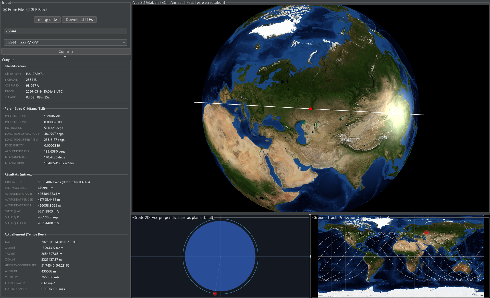
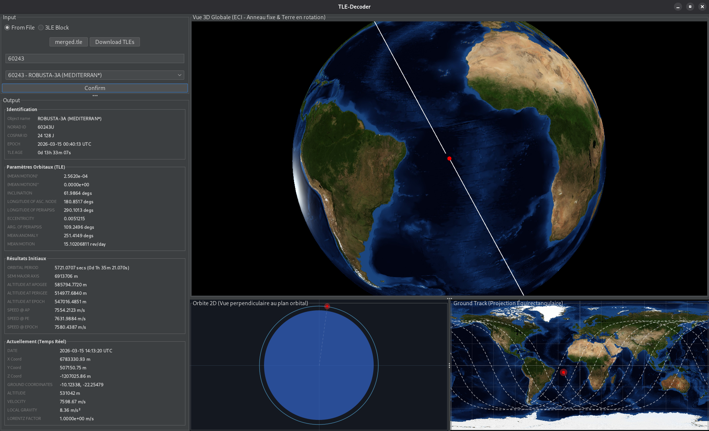
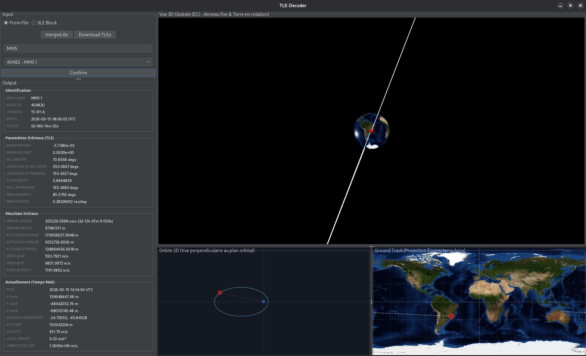
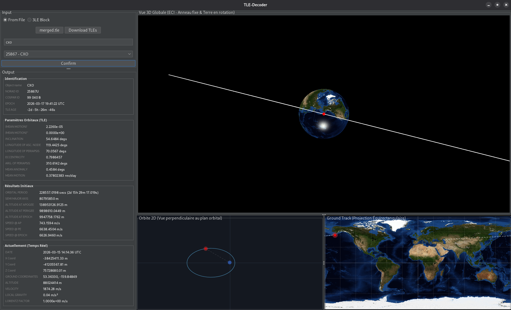

# KeplerTrack (anciennement TLE-Decoder-GUI)

## Utilisation

Fonctionne sur Windows, Linux et MacOS (en principe, j'ai pas de Mac pour tester)

Assurez-vous d'avoir au moins JRE 21 d'installé. Et ce sera tout.

Au démarrage il y aura un petit temps d'attente en raison du chargement de l'image de fond de la Terre.

### Exécution (Linux)

Si votre système accepte d'exécuter un .jar directement avec un simple double-clique, pas besoin d'ouvrir un terminal !

Sinon tapez simplement cette commande dans le terminal au même emplacement que le .jar, et n'oubliez pas de remplacer `{version}` par l'actuelle version.

```bash
java -jar KeplerTrack-{version}.jar
```

### Exécution (Windows)

#### Pour JRE 21

Sur Windows, si vous avez JRE 21 d'installé, un simple double-clique suffit.

#### Pour JRE > 21

Il vous faudra exécuter avec une commande depuis un cmd. Et n'oubliez pas de remplacer `{version}` par l'actuelle version.

```batch
java --enable-native-access=ALL-UNNAMED --add-opens java.desktop/sun.awt=ALL-UNNAMED -jar KeplerTrack-{version}.jar
```

## Captures d'écran








